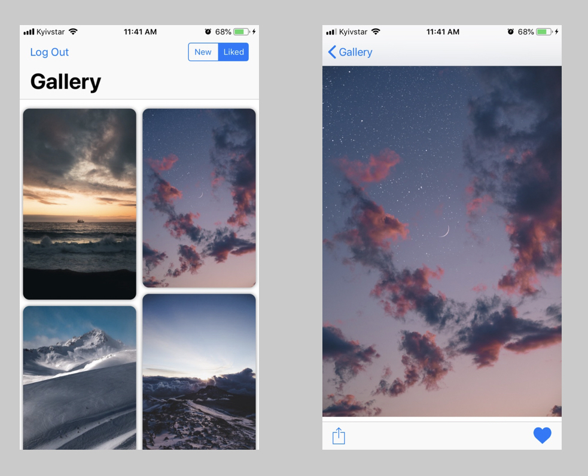

# Gallery
Client for [Unsplash](https://unsplash.com). Written to learn how to work with REST API.

## Abilities

* Show last photos feed
* Show liked photos of the logged-in user
* Like/Unlike photos
* Portrait/Landscape orientation
* Custom layout
* Sharing

