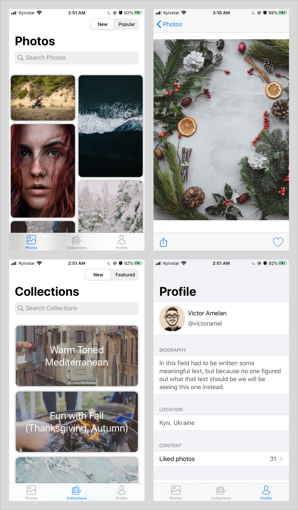

# Gallery
Client for [Unsplash](https://unsplash.com). Written to learn how to work with REST API.

## Abilities

* Show photos and collections feeds
* Search photos and collections
* Show liked photos of the logged-in user
* Edit logged-in user data
* Like/Unlike photos
* Portrait/Landscape orientation
* Sharing

## Used

* Collection view with  custom layout
* Scroll view
* Page view controller
* JSON parsing
* Static table view

